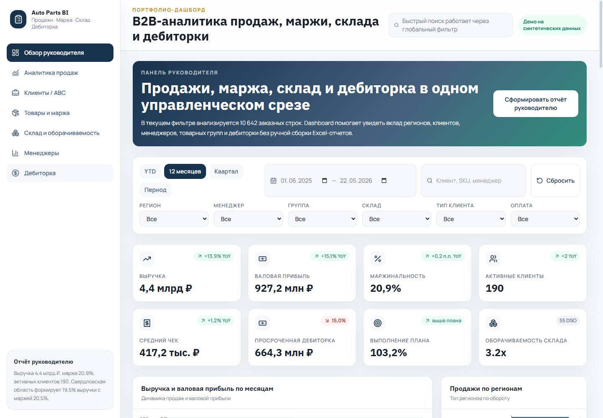
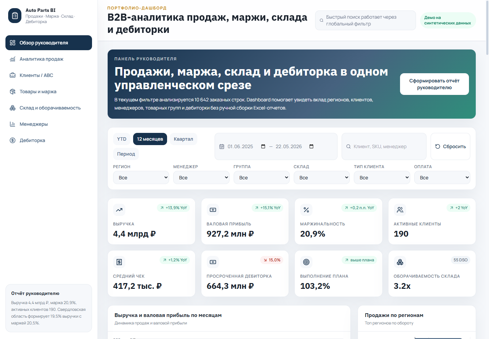
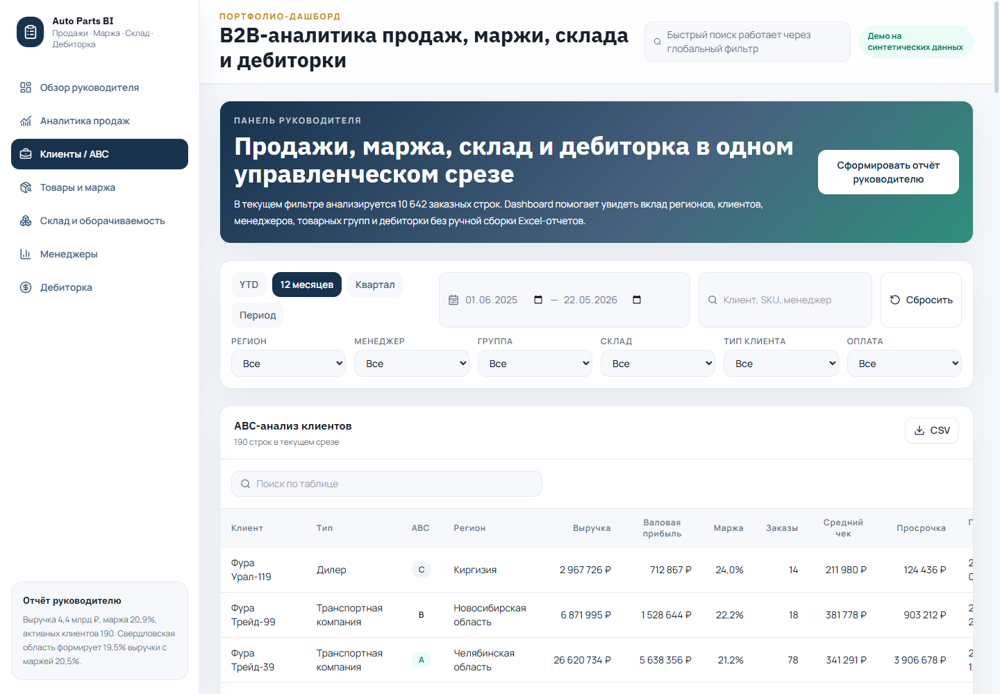
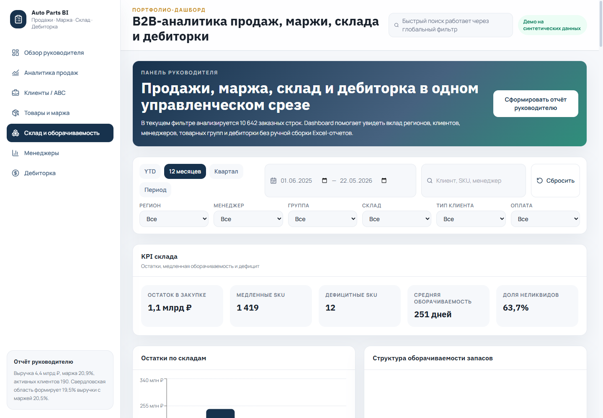
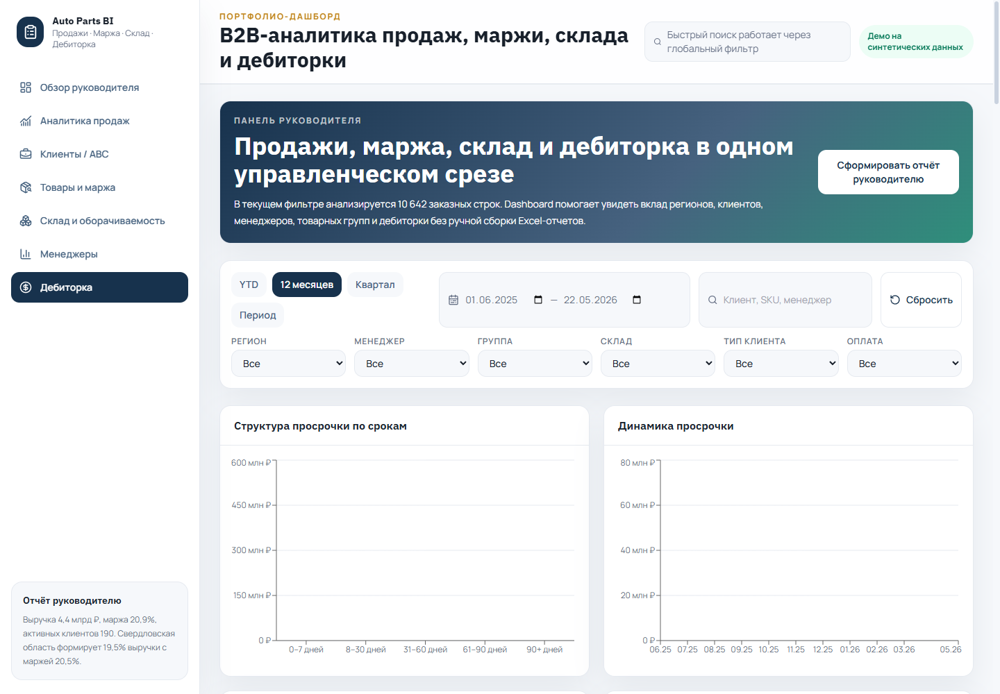

# B2B-дашборд продаж, маржи, склада и дебиторки автозапчастей

> React/Vite dashboard для B2B-дистрибуции автозапчастей: единый управленческий экран по выручке, марже, клиентам, складу, менеджерам и дебиторской задолженности.



---

## Links

- [Live demo](https://kilevoy.github.io/dashboard/)
- [Source code in this case](./app/)
- [Deployment repository](https://github.com/kilevoy/dashboard)

> `kilevoy/dashboard` используется как GitHub Pages deployment repository. Исходники также сохранены прямо в этом кейсе в папке [`app/`](./app/), чтобы портфолио было самодостаточным и проверяемым.

---

## Business Problem

В B2B-продажах автозапчастей коммерческому руководителю нужно быстро понимать не только выручку, но и качество этой выручки: маржу, вклад клиентов и регионов, просроченную дебиторку, выполнение плана менеджерами и состояние складских остатков.

Типовой ручной процесс через Excel создает несколько проблем:

- показатели продаж, склада и дебиторки живут в разных отчетах;
- сложно быстро увидеть, где рост выручки сопровождается падением маржи;
- просроченная задолженность видна слишком поздно;
- медленно оборачиваемые SKU и избыточный запас не связаны с продажами;
- руководитель тратит время на сборку управленческого среза вместо принятия решений.

---

## What Was Built

Создан интерактивный portfolio dashboard на синтетических данных, имитирующих B2B-дистрибуцию запасных частей для грузовиков, прицепов, сервисных центров, корпоративных автопарков и оптовых клиентов.

| Feature | Description |
|---------|-------------|
| Executive overview | KPI-карточки по выручке, валовой прибыли, марже, активным клиентам, среднему чеку, дебиторке, плану и оборачиваемости |
| YoY comparison | Динамические YoY-дельты вместо статичных демонстрационных процентов |
| Sales analytics | Динамика продаж, регионы, клиентские сегменты, средний чек и декомпозиция изменений |
| Clients / ABC | ABC-анализ клиентов, просрочка, маржа, риск-скоринг и последняя покупка |
| Product margin | Аналитика товарных групп, SKU, маржи, оборачиваемости и кандидатов на пересмотр цены |
| Inventory analytics | Остатки по складам, медленная оборачиваемость, избыточный запас и дефицит |
| Managers performance | План-факт, выручка, маржа, активные клиенты, скидки и дебиторка по менеджерам |
| Accounts receivable | Сроки просрочки, динамика просрочки, дебиторка по менеджерам и регионам |
| Global filters | Период, регион, менеджер, группа, склад, тип клиента, статус оплаты и быстрый поиск |
| CSV export | Выгрузка таблиц для дальнейшего анализа |

---

## Screenshots

### Executive Overview



### Clients / ABC



### Inventory



### Accounts Receivable



### Managers Performance


---

## Data Model

В проекте используются только синтетические данные. Генератор создает более 20 000 заказных строк за 2024-2026 годы и справочники клиентов, товаров, менеджеров, складов и остатков.

В данных заложены бизнес-паттерны:

- сезонность и рост в конце кварталов;
- разные маржи по товарным группам;
- концентрация выручки у топ-клиентов;
- системная просрочка у части клиентов;
- медленно оборачиваемые SKU;
- региональные тренды;
- влияние скидок на маржу.

---

## Business Value

Кейс показывает подход не к "рисованию графиков", а к сборке управленческой системы:

- единый экран связывает продажи, маржу, склад и дебиторку;
- руководитель видит причины риска, а не только итоговую сумму;
- таблицы и графики дают drill-down от KPI к клиентам, SKU и менеджерам;
- фильтры позволяют быстро проверить гипотезу по региону, складу или менеджеру;
- синтетическая модель данных демонстрирует понимание реальных коммерческих процессов.

---

## Tech Stack

- TypeScript
- React
- Vite
- Tailwind CSS
- Recharts
- date-fns
- GitHub Pages

---

## How To Run

```bash
cd app
npm install
npm run dev
```
