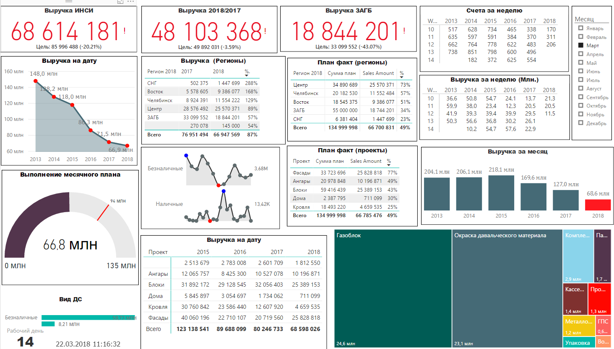
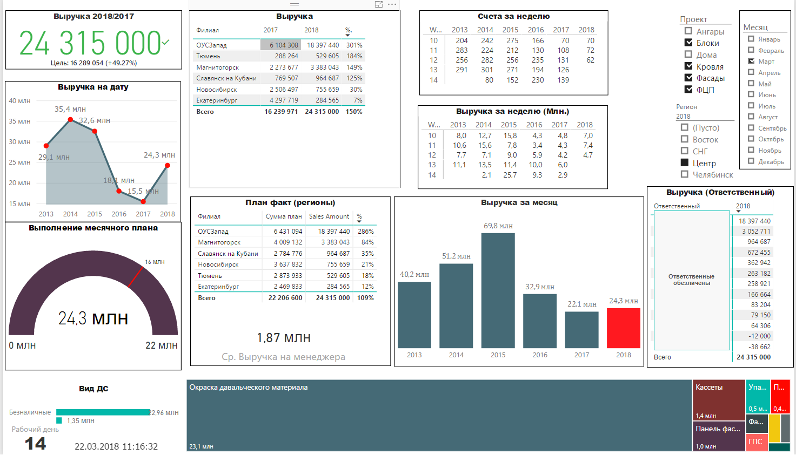
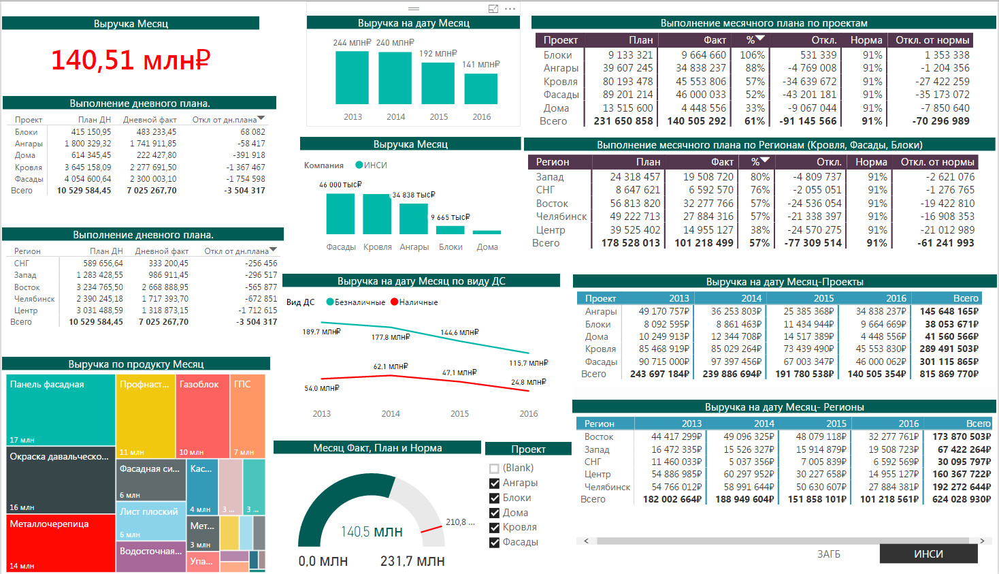
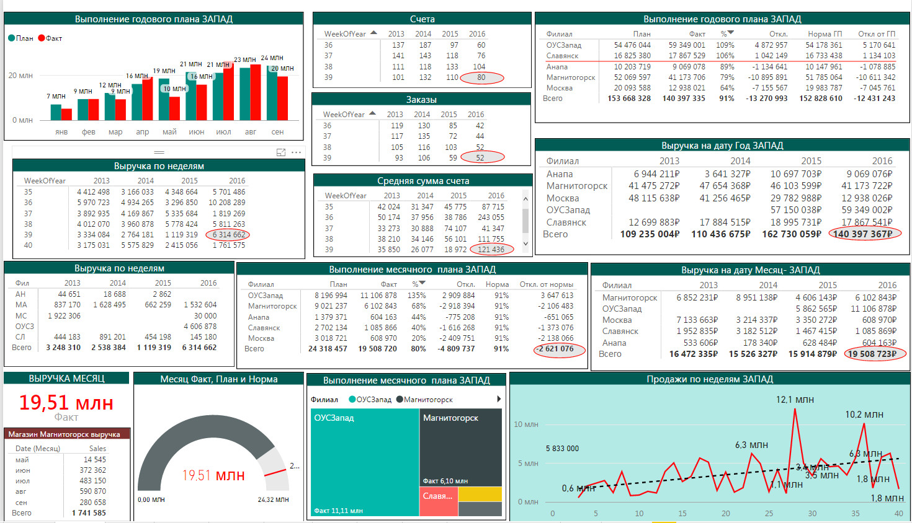

# Автоматизация управленческой отчетности по выручке в Power BI

> Набор Power BI-дашбордов для ежедневного контроля выручки, план-факта, счетов, заказов, регионов, проектов и ответственных в коммерческом блоке.

---

## Business Problem

Коммерческому руководителю нужно ежедневно видеть, как выполняется план продаж: какая выручка уже получена, где есть отставание от плана, какие регионы и проекты дают основной вклад, сколько счетов и заказов проходит по неделям.

До автоматизации отчетность приходилось собирать вручную из разных источников и таблиц. Это создавало типовые проблемы:

- разные версии цифр у руководителя, менеджеров и филиалов;
- долгий ручной сбор отчетов по выручке, счетам, проектам и регионам;
- сложность быстро увидеть отклонение от плана и нормы;
- зависимость отчета от конкретного сотрудника, который собирает данные;
- недостаточная детализация по неделям, месяцам, проектам и ответственным.

---

## What Was Done

Создан набор интерактивных Power BI-дашбордов для контроля коммерческих показателей. Отчеты собирают ключевые метрики в едином интерфейсе и позволяют смотреть выручку с разных управленческих срезов.

| Feature | Description |
|---------|-------------|
| KPI по выручке | Крупные карточки с текущей выручкой, целями и отклонениями |
| План-факт | Контроль выполнения дневного, месячного и годового плана |
| Динамика по годам | Сравнение выручки по годам, неделям и месяцам |
| Региональная аналитика | План-факт по регионам и филиалам |
| Проектная аналитика | Выручка и выполнение плана по проектам и продуктовым направлениям |
| Счета и заказы | Еженедельные таблицы по счетам, заказам и средней сумме счета |
| Фильтры | Срезы по месяцу, региону, проекту и другим управленческим параметрам |
| Treemap | Быстрая визуальная оценка вклада продуктовых направлений |
| Ответственные | Детализация по ответственным сотрудникам с обезличиванием в публичном скриншоте |

---

## Process Automated

Автоматизирован процесс подготовки управленческой отчетности по коммерческим показателям:

1. Данные по продажам, счетам, заказам, проектам и регионам приводятся к единой модели.
2. Power Query готовит и нормализует исходные таблицы.
3. DAX-меры считают выручку, план, факт, проценты выполнения, отклонения и нормы.
4. Power BI визуализирует показатели на страницах для руководителя и коммерческой команды.
5. Пользователь выбирает месяц, регион или проект и сразу видит нужный управленческий срез.
6. Отчет используется для ежедневного контроля выполнения плана и поиска отклонений.

---

## Architecture / Modules

| Module | Role |
|--------|------|
| Источники данных | Продажи, счета, заказы, планы, регионы, проекты и ответственные |
| Power Query | Очистка, объединение и подготовка таблиц для модели |
| Data Model | Связи между календарем, фактами продаж, планами и справочниками |
| DAX measures | Расчет выручки, плана, факта, отклонений, процентов выполнения и норм |
| Dashboard pages | Страницы для общей выручки, месячного плана, регионов и проектов |
| Visual filters | Срезы по месяцу, проекту, региону и другим параметрам |

---

## Stack

| Layer | Tech |
|-------|------|
| BI | Power BI |
| Data preparation | Power Query |
| Metrics | DAX |
| Sources | Excel / 1C data |
| Visualization | KPI cards, tables, line charts, bar charts, gauge, treemap, slicers |

---

## Business Impact

- **Единая версия отчетности**: руководитель и команда смотрят на одни и те же показатели.
- **Быстрее управленческий контроль**: ключевые отклонения видны на дашборде без ручной сборки таблиц.
- **Прозрачность план-факта**: выполнение плана видно по регионам, проектам и периодам.
- **Фокус на проблемных зонах**: подсветка отклонений помогает быстрее находить просадки.
- **Меньше ручной рутины**: повторяемый отчет заменяет регулярную ручную подготовку сводок.

---

## Screenshots

### Общий дашборд выручки, 2018

### Детализация по фильтрам и ответственным, 2018

### Месячный план и проектные срезы, 2016

### Региональный дашборд, Запад, 2016

---

## Links

- **Report:** внутренний Power BI-отчет, публичная demo-ссылка не публикуется.
- **Screenshots:** скриншоты сохранены в репозитории портфолио.

---

## Domain

Продажи, управленческая отчетность, коммерческий контроль, план-факт, региональная аналитика, проектная аналитика, производство и строительные материалы.

---

*Автор: Андрей Рыкунов | rykunov@gmail.com*
